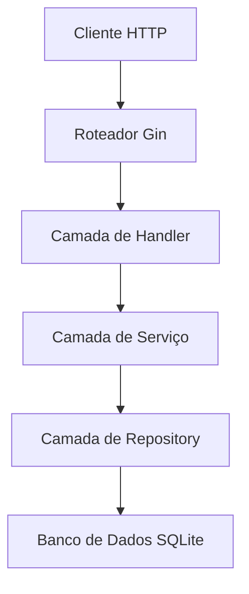

# 🚀 Aprendendo Go Na Prática: Construindo uma API REST do Zero com Arquitetura em Camadas

## 📚 Passo 1: O Começo - Por que Go?

Golang sempre me chamou atenção e para quem trabalha com JS/TS, recentemente chamou mais atenção por conta do novo copilador do TS que deve sair em breve, prometendo uma performance 10x melhor que o atual. Nesse artigo/tutorial vamos aprender a construir uma API REST completa usando as melhores práticas da comunidade Go, estou no processo de apendendo essa linguagem então o formato desse artigo/tutorial será baseado em milestones.

### 🎯 Objetivos do Projeto

- ✅ API REST Completa (CRUD)
- ✅ Banco de dados SQLite
- ✅ Arquitetura em Camadas (inspirada nos princípios de Clean Architecture)
- ✅ Seguindo convenções Go
- ✅ Aprendizado progressivo

---

## 📖 Ambiente: Configuração Inicial e Go Modules

### 📝 Primeiro Contato: Go Modules

```bash
go mod init todo-api
```

**Minhas primeiras impressões:**

- Go gerencia dependências de forma simples e eficiente
- `go.mod` é como o `package.json` do Node.js
- `go.sum` garante integridade das dependências
- **Go Modules é o sistema oficial de gerenciamento de dependências do Go** introduzido na versão 1.11
- Resolve o problema de "dependency hell" através de versionamento de pacotes
- Cada módulo tem um caminho único (como `todo-api`)
- `go.mod` contém o nome do módulo e a versão do Go
- `go.sum` contém checksums criptográficos para segurança

### 📦 Dependências Escolhidas

```go
go get github.com/gin-gonic/gin     # Router HTTP mais usado do mercado
go get modernc.org/sqlite          # Driver SQLite puro em Go
go get github.com/rs/cors           # Middleware CORS
```

**Por que Gin?** Durante minha pesquisa descobri que é o #1 em popularidade na comunidade Go, ~40x mais rápido que gorilla/mux, e usado por empresas como Uber e Didi.

---

## 🏗️ Organização: Estrutura de Pastas - Convenções Go

### 📁 Descobrindo Convenções

A comunidade Go tem convenções bem-definidas:

```
todo-api/
├── cmd/server/          # Executáveis da aplicação
├── internal/            # Código privado da aplicação
│   ├── config/          # Configurações
│   ├── database/        # Conexão com banco de dados
│   ├── handlers/        # Tratam requisições HTTP
│   ├── models/          # Modelos de dados
│   ├── repositories/    # Acesso aos dados
│   ├── services/        # Lógica de negócio
│   └── server/          # Configuração do servidor
├── pkg/                 # Código reutilizável
├── migrations/          # Scripts SQL
└── .spec/               # Documentação
```

**Insights:**

- `internal/` é para código que não deveria ser importado por outros projetos
- `pkg/` é para código de biblioteca reutilizável
- `cmd/` contém os pontos de entrada principais da aplicação
- **As convenções de pastas do Go fazem parte da filosofia da linguagem** - não são impostas pelo compilador, mas são padrões fortes da comunidade

---

## 🗄️ Persistência: Banco de Dados e SQLite

### 💡 Conhecendo database/sql

Go tem um pacote de banco de dados muito elegante:

```go
import "database/sql"

db, err := sql.Open("sqlite", "data/todos.db")
```

**O que descobri nessa etapa:**

- `database/sql` é uma interface, não uma implementação
- Connection pooling é nativo: `SetMaxOpenConns(25)`
- Prepared statements previnem SQL injection
- **O pacote database/sql fornece uma interface universal** para bancos de dados SQL
- Usa drivers (como `modernc.org/sqlite`) para implementar conexões específicas
- Connection pooling é nativo e crucial para performance
- **Prepared statements** são cacheados e reutilizados automaticamente

### 🔄 Migrações SQL

Comecei criando um sistema simples de migrações:

```sql
CREATE TABLE IF NOT EXISTS todos (
    id INTEGER PRIMARY KEY AUTOINCREMENT,
    title TEXT NOT NULL CHECK (length(title) >= 3),
    -- ... outros campos
);

-- Trigger automática para updated_at
CREATE TRIGGER update_todos_updated_at
    AFTER UPDATE ON todos
    FOR EACH ROW
    BEGIN
        UPDATE todos SET updated_at = CURRENT_TIMESTAMP WHERE id = NEW.id;
    END;
```

**Descoberta:** SQLite com triggers é poderoso para aplicações pequenas!

---

## 🏛️ Abstração: Padrão Repository - Implementação de Interfaces

### 🎯 Meu Primeiro Padrão: TodoRepository

```go
type TodoRepository interface {
    GetAll() ([]models.Todo, error)
    GetByID(id int64) (*models.Todo, error)
    Create(todo *models.Todo) error
    Update(todo *models.Todo) error
    Delete(id int64) error
}
```

**Minhas descobertas neste padrão:**

- Interfaces são implícitas - sem necessidade de dizer "implements"
- `sql.NullString` para campos opcionais no banco de dados
- Tratamento de erros é explícito e obrigatório
- **Interfaces Go são satisfeitas implicitamente** - se um tipo tem todos os métodos de uma interface, ele a implementa automaticamente
- Isso permite baixo acoplamento e testes fáceis
- **sql.NullString** lida com valores NULL do banco de dados graciosamente
- Filosofia de tratamento de erros do Go: "Erros são valores"

### 🔍 Interfaces e Tipos Go

```go
// Definição de interface
type TodoRepository interface {
    GetAll() ([]models.Todo, error)
}

// Implementação concreta
type todoRepository struct {
    db *database.DB
}

// Sem palavra-chave "implements" necessária!
// Go detecta automaticamente que isso implementa TodoRepository
func (r *todoRepository) GetAll() ([]models.Todo, error) {
    // implementação
}
```

**Insights que tive sobre interfaces Go:**

- **Satisfação implícita**: Sem necessidade de declarar implementação
- **Desacoplamento**: Interfaces definem comportamento, não implementação
- **Testes**: Fácil criar implementações mock
- **Interfaces pequenas**: Go favorece interfaces com 1-2 métodos

### 🎯 Ponteiros em Go

```go
// Receiver por valor (cópia)
func (r todoRepository) GetAll() ([]models.Todo, error) {
    // r é uma cópia do original
}

// Receiver por ponteiro (referência)
func (r *todoRepository) GetAll() ([]models.Todo, error) {
    // r aponta para o original
}
```

**O que aprendi sobre ponteiros:**

- **Receivers por valor**: Criam cópias, mais seguros para structs pequenas
- **Receivers por ponteiro**: Modificam o original, necessários para structs grandes ou ao modificar estado
- **Operador &**: Obter endereço de uma variável
- **Operador \***: Desreferenciar um ponteiro
- **Garbage collector do Go**: Gerencia memória automaticamente

### 🔍 Tratamento de Erros em Go

```go
if err == sql.ErrNoRows {
    return nil, fmt.Errorf("todo com id %d não encontrado", id)
}
return nil, fmt.Errorf("falha ao consultar todo: %w", err)
```

**A filosofia de tratamento de erros que Go adota:**

- **Erros são valores**, não exceções
- **Tratamento explícito**: `if err != nil` se torna natural
- **Retorno múltiplo**: Padrão `(resultado, erro)`
- **Wrapping de erro**: Verbo `%w` preserva o erro original
- **Erros sentinela**: `sql.ErrNoRows`, `io.EOF`, etc.

### 🎯 Tipos de Erro em Go

```go
// Erros sentinela (predefinidos)
var ErrNotFound = errors.New("todo não encontrado")

// Tipos de erro (erros customizados)
type ValidationError struct {
    Field   string
    Message string
}

func (e ValidationError) Error() string {
    return fmt.Sprintf("validação falhou para %s: %s", e.Field, e.Message)
}

// Wrapping de erro com contexto
if err != nil {
    return fmt.Errorf("falha ao criar todo: %w", err)
}

// Verificando erros encapsulados
if errors.Is(err, ErrNotFound) {
    // Lidar com não encontrado
}
```

**Os padrões que aprendi sobre tratamento de erros:**

- **Erros sentinela**: Para condições de erro previsíveis
- **Tipos de erro**: Para informações estruturadas de erro
- **Wrapping de erro**: Preservar contexto enquanto adiciona novas informações
- **Inspeção de erro**: `errors.Is()` e `errors.As()` para verificação de tipo

---

## 🧠 Lógica: Camada de Serviço - Implementando Negócio

### ✨ Validações e Regras de Negócio

```go
func (s *todoService) validateTodo(todo *models.Todo) error {
    if todo.Title == "" {
        return fmt.Errorf("título é obrigatório")
    }
    if len(todo.Title) < 3 {
        return fmt.Errorf("título deve ter pelo menos 3 caracteres")
    }
    return nil
}
```

**Características do Go que explorei aqui:**

- Strings em Go são imutáveis
- `strings.TrimSpace()` para normalização
- Retornos antecipados tornam o código mais legível
- **Imutabilidade** torna programas Go mais seguros e fáceis de raciocinar
- **Retornos antecipados** são um idioma Go que reduz aninhamento
- Operações com strings criam novas strings ao invés de modificar as existentes

### 🔄 Injeção Manual de Dependências

```go
repo := repositories.NewTodoRepository(db)
service := services.NewTodoService(repo)
```

**Conclusão nesta etapa:** Go não tem frameworks de DI complexos, e isso é proposital - injeção manual é simples e eficaz.

---

## 🌐 Comunicação: Handlers HTTP - Conhecendo Gin

### 🎹 Meus Primeiros Handlers

```go
func GetTodos(service services.TodoService) gin.HandlerFunc {
    return func(c *gin.Context) {
        todos, err := service.GetAll()
        if err != nil {
            c.JSON(http.StatusInternalServerError, gin.H{
                "error": "Falha ao obter todos",
            })
            return
        }
        c.JSON(http.StatusOK, todos)
    }
}
```

**Características do Gin que notei:**

- `c.JSON()` serializa automaticamente
- `c.ShouldBindJSON()` analisa o corpo da requisição
- Padrão de middleware é elegante
- **Gin usa handlers baseados em funções** que são simples e testáveis
- **Objetos Context** carregam dados de requisição e response writers
- **Encadeamento de middleware** é um padrão core em frameworks web Go

### 🚨 Refatoração: Princípio DRY

Em um ponto, comecei a notar repetição de código:

```go
// Antes (repetitivo)
c.JSON(http.StatusBadRequest, gin.H{
    "error": "Formato de ID inválido",
    "details": "ID deve ser um número",
})

// Depois (reutilizável)
utils.HandleIDError(c, err)
```

**Aí foi que criei utilitários em `pkg/utils/response.go`** - foi quando entendi que `pkg/` é exatamente para esse tipo de código compartilhável!

---

## 🏢 Arquitetura: Configuração do Servidor - Organizando Camadas

### 🏗️ Separando Responsabilidades

Em um certo ponto, meu `main.go` começava a ficar muito grande, então refatorei:

```go
// Antes: 100+ linhas em main.go
// Depois: 35 linhas em main.go + server.go

func main() {
    srv, err := server.NewServer()
    if err != nil {
        log.Fatalf("Falha ao criar servidor: %v", err)
    }
    defer srv.Close()

    // Graceful shutdown
    // ...
}
```

**Aprendizado importante:** O Princípio de Responsabilidade Única é ainda mais importante em Go!

### 🎯 Clarificação da Arquitetura

É importante notar que este projeto usa **arquitetura em camadas** inspirada pelos princípios de Clean Architecture, mas não é uma implementação pura de Clean Architecture. Temos:

- **Camada de Handler**: Tratamento de requisição/resposta HTTP
- **Camada de Serviço**: Lógica de negócio e validações
- **Camada de Repository**: Abstração de acesso aos dados
- **Camada de Banco de Dados**: Conexão SQLite e queries

Esta abordagem fornece boa separação de responsabilidades enquanto mantém a implementação simples e idiomática ao Go.

### 🔧 Graceful Shutdown

```go
quit := make(chan os.Signal, 1)
signal.Notify(quit, syscall.SIGINT, syscall.SIGTERM)
<-quit
log.Println("Encerrando servidor...")
```

**Descoberta:** Go tem tratamento de sinais nativo e elegante!

---

## 🎨 Documentação: Entendendo a Arquitetura

### 📐 Criando Diagramas com Mermaid

Para visualizar melhor a arquitetura, usei o servidor MCP para criar diagramas interativos:



**Dica útil:** FigJam com integração Mermaid é excelente para criar diagramas interativos e compartilháveis!

### 📚 Documentação Interativa com Swagger

Com a API crescendo, ficou claro que precisaríamos documentar os endpoints de forma profissional e acessível. Integrei o **Swagger** (OpenAPI) na aplicação:

```bash
go get -u github.com/swaggo/swag/cmd/swag
go get -u github.com/swaggo/gin-swagger
go get -u github.com/swaggo/files
```

**Adicionei comentários Swagger nos handlers:**

```go
// GetTodos retrieves all todos
// @Summary Get all todos
// @Description Retrieves a list of all todos from the database
// @Tags todos
// @Accept  json
// @Produce json
// @Success 200 {array} object "List of todos"
// @Router /todos [get]
func GetTodos(service services.TodoService) gin.HandlerFunc {
    // ...
}
```

**Configuração na rota principal:**

```go
r.GET("/swagger/*any", ginSwagger.WrapHandler(swaggerFiles.Handler))
```

**Benefícios descobertos:**

- **Interface interativa**: Os clientes da API podem explorar todos os endpoints
- **Testes diretos**: O Swagger UI permite fazer requisições de teste
- **Documentação automática**: A documentação fica sempre sincronizada com o código
- **Padrão OpenAPI**: Usa o padrão OpenAPI, permitindo integração com outras ferramentas
- **Acesso em `/swagger/index.html`**: Interface acessível e profissional

---

## 📊 Distribuição: Git e Versionamento

### 🌲 Commits Atômicos

Durante esse processo, aprendi a fazer pequenos commits descritivos:

```bash
feat: adicionar modelo Todo com tags JSON e DB
feat: implementar TodoRepository com operações CRUD
feat: adicionar TodoService com validações de lógica de negócio
feat: implementar handlers HTTP separados por ação
docs: adicionar documentação de arquitetura
```

**Convenção:** Conventional Commits com `feat:`, `docs:`, `fix:`

### 📝 .gitignore estilo Go

```gitignore
# Binários
main
*.exe

# Banco de dados
data/*.db

# IDE
.vscode/
.idea/
```

---

## 🚀 Publicação: Deploy e Documentação Final

### 📖 README Profissional

Com tudo pronto, criei uma documentação completa com:

- Documentação da API
- Exemplos de uso
- Visão geral da arquitetura
- Instruções de setup

### 🌍 Publicando no GitHub

```bash
git remote add origin https://github.com/davi1985/todo-service-golang.git
git push -u origin main
```

**Resultado final:** Um projeto público, bem documentado e pronto para ser explorado por outros!

---

## 🎓 Principais Aprendizados com Go

### 1. **Simplicidade é Poder**

- Go não tem mágica, tudo é explícito
- Menos features = mais previsível

### 2. **Tratamento de Erros é Cultura**

- Sem exceções, mas wrapping de erro é poderoso
- `if err != nil` se torna natural

### 3. **Interfaces são Implícitas**

- Sem necessidade de declarar "implements"
- Duck typing: "Se anda como um pato..."

### 4. **Concorrência é Nativa**

- Goroutines e channels estão em todos os lugares
- Ainda não explorei, mas vejo o potencial
