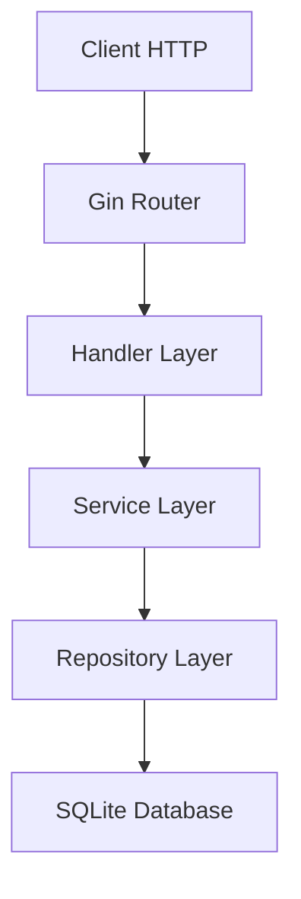

# 🚀 My Go Journey: Building a REST API from Scratch with Layered Architecture

## 📚 Step 1: The Beginning - Why Go?

As an experienced developer in other languages, I've always been curious about Go. Today I decided to dive deep! The goal? Build a complete REST API using Go community best practices.

### 🎯 Project Objectives

- ✅ Complete REST API (CRUD)
- ✅ SQLite database
- ✅ Layered Architecture (inspired by Clean Architecture principles)
- ✅ Following Go conventions
- ✅ Progressive learning

---

## 📖 Step 1: Initial Setup and Go Modules

### 📝 First Learning: Go Modules

```bash
go mod init todo-api
```

**What I learned:**

- Go manages dependencies simply and efficiently
- `go.mod` is like Node.js's `package.json`
- `go.sum` ensures dependency integrity
- **Go Modules are Go's official dependency management system** introduced in Go 1.11
- They solve the "dependency hell" problem by versioning packages
- Each module has a unique module path (like `todo-api`)
- `go.mod` contains the module name and Go version
- `go.sum` contains cryptographic checksums for security

### 📦 Dependencies Chosen

```go
go get github.com/gin-gonic/gin     # Most used HTTP router in the market
go get modernc.org/sqlite          # Pure Go SQLite driver
go get github.com/rs/cors           # CORS middleware
```

**Why Gin?** I researched and discovered it's #1 in popularity in the Go community, ~40x faster than gorilla/mux, and used by companies like Uber and Didi.

---

## 🏗️ Step 2: Folder Structure - Go Conventions

### 📁 Learning About Structure

The Go community has well-defined conventions:

```
todo-api/
├── cmd/server/          # Application executables
├── internal/            # Private application code
│   ├── config/          # Configurations
│   ├── database/        # Database connection
│   ├── handlers/        # Handle HTTP requests
│   ├── models/          # Data models
│   ├── repositories/    # Data access
│   ├── services/        # Business logic
│   └── server/          # Server configuration
├── pkg/                 # Reusable code
├── migrations/          # SQL scripts
└── .spec/               # Documentation
```

**Insights:**

- `internal/` is for code that shouldn't be imported by other projects
- `pkg/` is for reusable library code
- `cmd/` contains the main application entry points
- **Go's folder conventions are part of the language's philosophy** - they're not enforced by the compiler but are strong community standards

---

## 🗄️ Step 3: Database and SQLite

### 💡 First Contact with database/sql

Go has a very elegant standard database package:

```go
import "database/sql"

db, err := sql.Open("sqlite", "data/todos.db")
```

**Important learnings:**

- `database/sql` is an interface, not an implementation
- Connection pooling is native: `SetMaxOpenConns(25)`
- Prepared statements prevent SQL injection
- **The database/sql package provides a universal interface** for SQL databases
- It uses drivers (like `modernc.org/sqlite`) to implement specific database connections
- Connection pooling is built-in and crucial for performance
- **Prepared statements** are cached and reused automatically

### 🔄 SQL Migrations

I created a simple migration system:

```sql
CREATE TABLE IF NOT EXISTS todos (
    id INTEGER PRIMARY KEY AUTOINCREMENT,
    title TEXT NOT NULL CHECK (length(title) >= 3),
    -- ... other fields
);

-- Automatic trigger for updated_at
CREATE TRIGGER update_todos_updated_at
    AFTER UPDATE ON todos
    FOR EACH ROW
    BEGIN
        UPDATE todos SET updated_at = CURRENT_TIMESTAMP WHERE id = NEW.id;
    END;
```

**Discovery:** SQLite with triggers is powerful for small applications!

---

## 🏛️ Step 4: Repository Pattern - Interface Implementation

### 🎯 Implementing TodoRepository

```go
type TodoRepository interface {
    GetAll() ([]models.Todo, error)
    GetByID(id int64) (*models.Todo, error)
    Create(todo *models.Todo) error
    Update(todo *models.Todo) error
    Delete(id int64) error
}
```

**Go learnings:**

- Interfaces are implicit - no need to say "implements"
- `sql.NullString` for optional database fields
- Error handling is explicit and mandatory
- **Go interfaces are satisfied implicitly** - if a type has all methods of an interface, it implements it automatically
- This enables loose coupling and easy testing
- **sql.NullString** handles NULL database values gracefully
- Go's error handling philosophy: "Errors are values"

### 🔍 Go Interfaces and Types

```go
// Interface definition
type TodoRepository interface {
    GetAll() ([]models.Todo, error)
}

// Concrete implementation
type todoRepository struct {
    db *database.DB
}

// No "implements" keyword needed!
// Go automatically detects this implements TodoRepository
func (r *todoRepository) GetAll() ([]models.Todo, error) {
    // implementation
}
```

**Key insights about Go interfaces:**

- **Implicit satisfaction**: No need to declare implementation
- **Decoupling**: Interfaces define behavior, not implementation
- **Testing**: Easy to create mock implementations
- **Small interfaces**: Go favors interfaces with 1-2 methods

### 🎯 Pointers in Go

```go
// Value receiver (copy)
func (r todoRepository) GetAll() ([]models.Todo, error) {
    // r is a copy of the original
}

// Pointer receiver (reference)
func (r *todoRepository) GetAll() ([]models.Todo, error) {
    // r points to the original
}
```

**Learning about pointers:**

- **Value receivers**: Create copies, safer for small structs
- **Pointer receivers**: Modify original, needed for large structs or when modifying state
- **& operator**: Get address of a variable
- **\* operator**: Dereference a pointer
- **Go garbage collector**: Handles memory management automatically

### 🔍 Go Error Handling

```go
if err == sql.ErrNoRows {
    return nil, fmt.Errorf("todo with id %d not found", id)
}
return nil, fmt.Errorf("failed to query todo: %w", err)
```

**Go error handling philosophy:**

- **Errors are values**, not exceptions
- **Explicit handling**: `if err != nil` becomes natural
- **Multiple return values**: `(result, error)` pattern
- **Error wrapping**: `%w` verb preserves original error
- **Sentinel errors**: `sql.ErrNoRows`, `io.EOF`, etc.

### 🎯 Error Types in Go

```go
// Sentinel errors (predefined)
var ErrNotFound = errors.New("todo not found")

// Error types (custom errors)
type ValidationError struct {
    Field   string
    Message string
}

func (e ValidationError) Error() string {
    return fmt.Sprintf("validation failed for %s: %s", e.Field, e.Message)
}

// Error wrapping with context
if err != nil {
    return fmt.Errorf("failed to create todo: %w", err)
}

// Checking wrapped errors
if errors.Is(err, ErrNotFound) {
    // Handle not found
}
```

**Error handling patterns learned:**

- **Sentinel errors**: For predictable error conditions
- **Error types**: For structured error information
- **Error wrapping**: Preserve context while adding new information
- **Error inspection**: `errors.Is()` and `errors.As()` for type checking

---

## 🧠 Step 5: Service Layer - Business Logic

### ✨ Validations and Rules

```go
func (s *todoService) validateTodo(todo *models.Todo) error {
    if todo.Title == "" {
        return fmt.Errorf("title is required")
    }
    if len(todo.Title) < 3 {
        return fmt.Errorf("title must be at least 3 characters")
    }
    return nil
}
```

**Go learnings:**

- Strings in Go are immutable
- `strings.TrimSpace()` for normalization
- Early returns make code more readable
- **Immutability** makes Go programs safer and easier to reason about
- **Early returns** are a Go idiom that reduces nesting
- String operations create new strings rather than modifying existing ones

### 🔄 Manual Dependency Injection

```go
repo := repositories.NewTodoRepository(db)
service := services.NewTodoService(repo)
```

**Discovery:** Go doesn't have complex DI frameworks, but manual injection is simple and effective.

---

## 🌐 Step 6: HTTP Handlers - Meeting Gin Framework

### 🎹 First Handlers

```go
func GetTodos(service services.TodoService) gin.HandlerFunc {
    return func(c *gin.Context) {
        todos, err := service.GetAll()
        if err != nil {
            c.JSON(http.StatusInternalServerError, gin.H{
                "error": "Failed to get todos",
            })
            return
        }
        c.JSON(http.StatusOK, todos)
    }
}
```

**Gin learnings:**

- `c.JSON()` serializes automatically
- `c.ShouldBindJSON()` parses request body
- Middleware pattern is elegant
- **Gin uses function-based handlers** which are simple and testable
- **Context objects** carry request data and response writers
- **Middleware chaining** is a core pattern in Go web frameworks

### 🚨 Refactoring: DRY Principle

I noticed code repetition:

```go
// Before (repetitive)
c.JSON(http.StatusBadRequest, gin.H{
    "error": "Invalid ID format",
    "details": "ID must be a number",
})

// After (reusable)
utils.HandleIDError(c, err)
```

**Created utilities in `pkg/utils/response.go`** - learned that `pkg/` is for shareable code!

---

## 🏢 Step 7: Server Configuration - Layered Architecture

### 🏗️ Separating Responsibilities

The `main.go` was getting large. I refactored:

```go
// Before: 100+ lines in main.go
// After: 35 lines in main.go + server.go

func main() {
    srv, err := server.NewServer()
    if err != nil {
        log.Fatalf("Failed to create server: %v", err)
    }
    defer srv.Close()

    // Graceful shutdown
    // ...
}
```

**Learning:** Single Responsibility Principle is even more important in Go!

### 🎯 Architecture Clarification

It's important to note that this project uses **layered architecture** inspired by Clean Architecture principles, but it's not a pure Clean Architecture implementation. We have:

- **Handler Layer**: HTTP request/response handling
- **Service Layer**: Business logic and validations
- **Repository Layer**: Data access abstraction
- **Database Layer**: SQLite connection and queries

This approach provides good separation of concerns while keeping the implementation simple and Go-idiomatic.

### 🔧 Graceful Shutdown

```go
quit := make(chan os.Signal, 1)
signal.Notify(quit, syscall.SIGINT, syscall.SIGTERM)
<-quit
log.Println("Shutting down server...")
```

**Discovery:** Go has native and elegant signal handling!

---

## 🎨 Step 8: Documentation and Diagrams

### 📐 Creating Diagrams with Mermaid

I used the MCP server to create interactive diagrams:



**New tool:** FigJam with Mermaid integration - interactive and shareable diagrams!

---

## 📊 Step 9: Git and Versioning

### 🌲 Atomic Commits

I learned to make small, descriptive commits:

```bash
feat: add Todo model with JSON and DB tags
feat: implement TodoRepository with CRUD operations
feat: add TodoService with business logic validations
feat: implement HTTP handlers separated by action
docs: add architecture documentation
```

**Convention:** Conventional Commits with `feat:`, `docs:`, `fix:`

### 📝 Go-style .gitignore

```gitignore
# Binaries
main
*.exe

# Database
data/*.db

# IDE
.vscode/
.idea/
```

---

## 🚀 Step 10: Deploy and Final Documentation

### 📖 Professional README

I created complete documentation with:

- API documentation
- Usage examples
- Architecture overview
- Setup instructions

### 🌍 Publishing on GitHub

```bash
git remote add origin https://github.com/davi1985/todo-service-golang.git
git push -u origin main
```

**Result:** Public and documented project!

---

## 🎓 Key Go Learnings

### 1. **Simplicity is Power**

- Go has no magic, everything is explicit
- Less features = more predictable

### 2. **Error Handling is Culture**

- No exceptions, but error wrapping is powerful
- `if err != nil` becomes natural

### 3. **Interfaces are Implicit**

- No need to declare "implements"
- Duck typing: "If it walks like a duck..."

### 4. **Concurrency is Native**

- Goroutines and channels are everywhere
- Haven't explored yet, but see the potential
